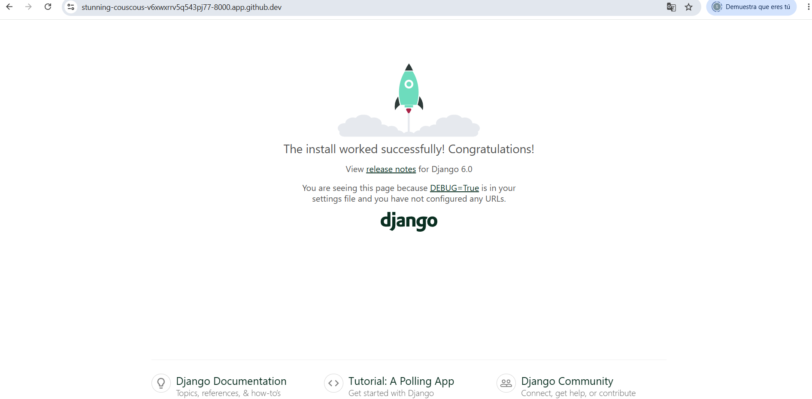

Instrucciones
Crea una carpeta llamada actividad_m6_l2 y dentro de ella un documento llamado proyecto_django.md. En él
deberás registrar todo el proceso de creación y configuración inicial de un proyecto Django llamado mi_sitio.
1. Instalación en entorno virtual
Desde tu terminal, ejecuta los siguientes pasos y explica en cada uno qué está ocurriendo:

__Comenta: ¿Qué es pip?__

     **Es el sistema de gestión de paquetes estándar para Python. Básicamente, es la herramienta que te permite** 
     **descargare** instalar librerías y dependencias que no vienen incluidas en la instalación básica de Python **


 __¿Qué ventajas ofrece instalar Django dentro de un entorno virtual?__

     **Un entorno virtual es un espacio aislado  donde se puede instalar versiones específicas de librerías para un**
      **proyecto sin afectar a los demás proyectos ni al Python "global" del sistema.**

    
2. Crear el proyecto


• __Copia la estructura generada por Django y pégala en tu archivo .md__ 

    .   ```
        ├── README.md
        ├── manage.py
        ├── mi_sitio
        │   ├── __init__.py
        │   ├── asgi.py
        │   ├── settings.py
        │   ├── urls.py
        │   └── wsgi.py
        ├── proyecto_django.md
        └── requirements.txt
        

__explicando para qué sirve cada uno de los siguientes elementos:__

    • manage.py:    Es un script de Python que Django  crea automáticamente en la raíz de tu proyecto. Su función principal es servir de puente entre la línea de comandos (tu terminal) y las entrañas de Django,permitiéndote ejecutar tareas de administración, arrancar el servidor o gestionar la base de datos.

    • mi_sitio/__init__.py: Es un archivo que se genera automaticamente, para decir que es un modulo de python

    • mi_sitio/settings.py: archivo de configuración de Python donde defines cómo debe comportarse tu aplicación con qué bases de datos se comunica, qué funciones de seguridad están activas

    • mi_sitio/urls.py: Su función principal es conectar las URLs que los usuarios escriben en sus navegadores (como /contacto/ o /productos/) con las vistas (el código Python en views.py) que deben responder a esa petición

    • mi_sitio/asgi.py:  Es el archivo que permite  que tu proyecto de Django deje de ser "tradicional"(donde el usuario pide una página, el servidor responde y se corta la conexión) y se convierta en una aplicación asíncrona y en tiempo real**


    • mi_sitio/wsgi.py:  Es el punto de entrada estándar y tradicional para que un servidor web de producción se comuniquecon tu proyecto Django


3. Ejecutar el servidor
• Corre el servidor de desarrollo con:

• Visita http://127.0.0.1:8000/ y toma una captura de pantalla mostrando que el servidor funciona
correctamente.



4. Crear una aplicación
• Crea una aplicación llamada principal:

• Explica brevemente:
__¿Qué diferencia hay entre un “proyecto” y una “aplicación” en Django?__

    Un proyecto es una web completa, mientras que una aplicación es una sección o función específica de esa web.


• __¿Qué carpetas se generan dentro de la app principal?__

    ```    
    principal/
    ├── migrations/         
    │   └── __init__.py
    ├── __init__.py
    ├── admin.py
    ├── apps.py
    ├── models.py
    ├── tests.py
    └── views.py

5. Configuración del proyecto
• Agrega 'principal' al INSTALLED_APPS de settings.py.

     INSTALLED_APPS = [
        "django.contrib.admin",
        "django.contrib.auth",
        "django.contrib.contenttypes",
        "django.contrib.sessions",
        "django.contrib.messages",
        "django.contrib.staticfiles",
        "principal"
        ]
• Crea un archivo urls.py dentro de la app principal y
 configura el enrutamiento en mi_sitio/urls.py para
que dirija hacia esa app.

        from django.shortcuts import render
        from django.http import HttpResponse

        def home(request):
        return HttpResponse ("Hola es mi App Principal")

